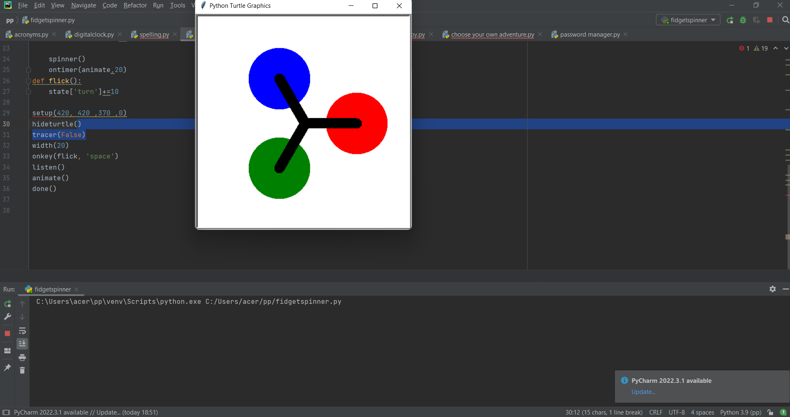

# Fidget-Spinner-prime
This is a project where I have created a virtual fidget spinner. The fidget spinner rotates when you press the spacebar on the keyboard.

 

## Libraries
* Time

## Requirements
* Pycharm
* Python

## Code 

* [Code](code/fidgetspinner.py)

